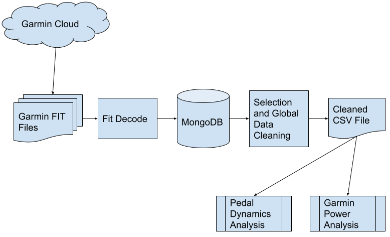

Data Analytics and Engineering - AIT580
=======================================
Working Project Submission Readme
---------------------------------

This readme described the full system outline for processing Garmin Data for the
AIT580 project by team 2 completed during the summer term of 2020.

The code is operational but certainly not production ready. As this task was larger
than expected, automated tests and other production required components were not
completed.  The system contains the following components.

The following provides detail on the contents of the AIT580_Team2_Jain_Maxseiner_Shelton_Working_Project.zip file.

Overall the system contains the following components.
* FIT Data Files - These were downloaded from Garmin Cloud services and contain data for only one user.
* FITData Decoding Python - Program, configuration and library files for a python program that extracts data from the FIT files and inserts them into a Mongo DB.
* MongoDB - A database that stores the documents generated from the FITData Decoding program.
* Data Selection and Global Cleaning - Selection and common data cleaning 
* Power Analysis - Data cleaning and analysis for power analysis
* Pedaling Dynamics Analysis - Data cleaning and analysis for pedaling dynamics analysis

 

The following sections provide implementation details for each of these components. 

FitData Decoding
----------------
* **Purpose:** This program decodes FIT messages into data that can be analyzed.  The fitdecode library is used to 
decode the fit messages into python objects.  Code is then used to convert these objects into MongoDB records 
or JSON files.
* **Components:**  Python program, settings.json and associated libraries.
* **Development Environment:** PyCharm
* **Python Version:** 3.9
* **Platform:** Mac OS
* **Libraries:** fitdecode, pymongo, JSON, argparse, datetime, logging, pprint, os, pandas, time, sys, json
* **Relevant Files:**
  * main.py
  * setting.json
  * readme.md
* **Execution Time:** about 4 hours on an M1 Mac
* **Result:** A Mongo DB collection with 13,372,221 documents
* **Execution Instructions:** 
  * Load required libraries
  * Configure the settings.json file
  * run main with one parameter that is the name of the configuration in settings.json to be loaded
* **References:** fitdecode - https://pypi.org/project/fitdecode/
    
** Configuration of Setting.json**
The program is controlled by a settings.json configuration file.  The following is an example
setting.  The setting name is passed as a parameter to the this program.

```{
 "small": {
         "directory": "/Users/ronaldmaxseiner/downloads/garminData/DI_CONNECT/DI-Connect-Fitness-Uploaded-Files",
        "dump_directory": "/Users/ronaldmaxseiner/documents/garmin/dataDecode/debugDump",
         "fileType": ".fit",
         "reloadDB": "True",
         "debug": "False",
         "db_insert": "db",
         "document_skip": 50,
         "document_limit": 25000,
         "collection_name": "activity_small",
         "mongo_connection_string":  "localhost"}
 }
```
 These controls have the following purpose.
* directory - location of the fit data files.
* dump_directory - location to place JSON files when this mode is selected.
* fileType - The extension of the fit data files. Usually ".fit"
* debug - Turns on or off debug messages. Set to "True" to enable debugging otherwise set to "False"
* db_insert - Enables database or JSON output.  Set to "db" for mongo db records. Set to "Full" for JSON.
* document_skip - This features skips records to reduce processing type.  Useful for debugging.
                   Set to 1 to process all records.  Often set to 100 for debugging.
* collection_name - collection name where MongoDB records will be inserted.
* mongo_db_string - connection string for mongo database.  Use "localhost" for local database

Database
--------
* **Purpose:** Allow for the storage of all FIT messages.  Enables the querying and selection of data within the
        full list of fit messages.  The FIT messages are very comprehensive and it is necessary to select
        specific areas to analyze.
* **Components:** Mongo Database
* **Development Environment:** Mongo Compass, Mongosh
* **Mongo Version:** Community 4.4
* **Platform:** Mac OS
* **Relevant Files:** None  
* **Execution Instructions:** 
  * Install MongoDB Community Edition 4.4
  * Create Database with name 'fit'
* **Result:** Mongo Files consume about  5.4 GB of disk space. 
* **References: ** MongoDB Community Edition - https://www.mongodb.com/try/download/community
    
Data Selection and Global Cleaning
----------------------------------
* **Purpose:**  This Jupyter file selects data from the Mongo database and performs the following data cleaning steps.
    Selection Criteria: Message Type 20 and FitDataMessage
    Clean-up Steps:
  1. Replace 'None' with Nan
  2. Convert position columns (lat, long) to numeric values from string.
  3. Remove null (Nan) values from data set for the following columns (position_lat, speed, cadence,heart_rate)
  4. Remove columns that are not populated or duplicate. ('eE', 'unknown_87', 'message_timeOffset',
                'activity_type', 'distance_1', 'distance_2', 'message_chunk' and 'message_isDeveloperData')
  5. Replace 'Right' in 'left_right_balance' with NaN
  6. Convert timestamp column to datetime value from string.

    This results in a file that has valid values for most columns. Some columns are missing data because sensors
    were not available during those rides.  Those values have been left as they may be useful in the analysis.
* **Components:** Jupyter Notebook, Python
* **Libraries:** pymongo, pandas, numpy
* **Relevant Files:** Garmin Data Clean-up.ipynb  
* **Execution Instructions:** 
  * Install python libraries 
  * Install Jupyter Notebook
  * Open 'Garmin Data Clean-up.ipynb'
* **Result:** a CSV file with 1,616,885 records and 40 columns
    
Power Analysis
--------------
* **Purpose:** Clean data in preparation for power analysis and perform power analysis.
* **Components:** Jupyter Notebook, Python
* **Key Libraries:** pandas, numpy, matplotlib, sklearn, seaborn
* **Relevant Files:** Garmin Power Analysis.ipynb  
* **Execution Instructions:** 
  * Install python libraries 
  * Install Jupyter Notebook
  * Open 'Garmin Power Analysis.ipynb'
* **Result:** Analysis results displayed into the Jupyter Notebook

Pedaling Dynamics Analysis
--------------------------
* **Purpose:** Clean data in preparation for power analysis and perform power analysis.
* **Components:** Jupyter Notebook, Python
* **Key Libraries:** pandas, numpy, matplotlib, sklearn, seaborn
* **Relevant Files:** Pedal Dynamics Analysis.ipynb  
* **Execution Instructions:** 
  * Install python libraries 
  * Install Jupyter Notebook
  * Open 'Pedal Dynamics Analysis.ipynb'
* **Result:** Analysis results displayed into the Jupyter Notebook